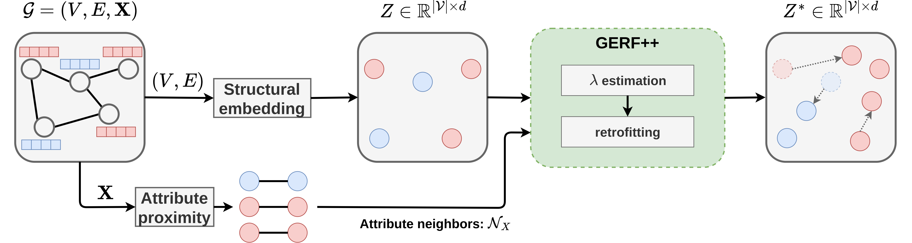

# Graph Embedding RetroFitting (GERF)
This repository provides the official implementation of the Graph Embedding Retrofitting method,
which was introduced in the *Retrofitting structural graph embeddings with node attribute information*
paper. It also includes the whole experimental pipeline which is built using DVC.




### How to use?
- create and activate virtual environment (`venv`)
- install dependencies (`pip install -r requirements.txt`)
- *pull all files from the DVC remote (`dvc pull`)

(*) The whole pipeline should be reproducible without any external data dependencies.
If you want to use precomputed stage outputs, please perform the `dvc pull` command
and it will download all stage artifacts into the `data/` directory. You don't
need any credentials as a public DVC remote endpoint is used in the DVC configuration
file. The total size of all artifacts is about 20GB.

If you want to use Docker instead of virtual environments, this repo contains also
a ready-to-use Dockerfile:
```bash
docker build -t gerf:latest -f docker/Dockerfile .

./docker/run-docker-gpu.sh "<gpu-id>"
```

## Training & evaluation
We implement all our models using the PyTorch-Geometric library and use DVC
(Data Version Control) for model versioning. DVC enables to run all experiments
in a single command and ensure better reproducibility. To reproduce the whole
pipeline run: `dvc repro` and to execute a single stage use: `dvc repro -f -s <stage name>`

There are following stages (see `dvc.yaml` file):
- `embed_node2vec@<dataset_name>` – uses the Node2vec method for computing structural node embeddings,
- `embed_line@<dataset_name>` – uses the LINE method for computing structural node embeddings,
- `embed_sdne@<dataset_name>` – uses the SDNE method for computing structural node embeddings,
- `embed_tadw@<dataset_name>` – uses the TADW method for computing attributed node embeddings,
- `embed_fscnmf@<dataset_name>` – uses the FSCNMF method for computing attributed node embeddings,
- `embed_dgi@<dataset_name>` – uses the DGI method for computing attributed node embeddings,
- `apply_concat_refiner@<dataset_name>` – computes node embeddings as the naive concatenation of structural embeddings and node attributes,
- `apply_concat_pca_refiner@<dataset_name>` – similar to the above, but applies PCA to the resulting embedding vectors,
- `apply_mlp_refiner@<dataset_name>` – computes node embeddings as an MLP applied on the structural embeddings and node attributes,
- `hps_GERF@<dataset_name>` – runs the grid search over GERF's hyperparameters,
- `apply_GERF@<dataset_name>` – computes node embeddings using our proposed GERF method,
- `evaluate_node_classification@<dataset_name>` – evaluates node embeddings (specified in the configuration file) in a node classification task,
- `make_report_tables` - summarizes node classification performance into a single table,
- `make_hps_plot@<dataset_name>` - prepares a visualization of the hyperparameter grid search.


All hyperparameters are stored in configuration files in the `experiments/configs/`
directory, whereas the experimental Python scripts are placed in the `experiments/scripts/` directory.

## Reference
If you make use GERF in your research, please cite it using the following entry:

```
TBA
```

## License
MIT
